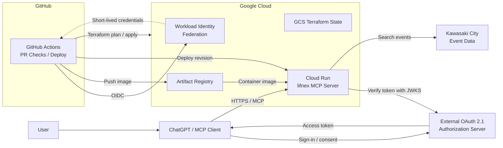

# lifnex

**lifnex** (pronounced "life-nex") is a personal remote MCP server that
connects AI assistants with local and everyday-life information.

The current implementation provides authenticated access to Kawasaki City
event data and runs on Google Cloud Run.

## MCP Tools

| Tool | Description |
| --- | --- |
| `hello` | Return a hello-world greeting. |
| `search_events` | Search Kawasaki City events by date range, title keyword, and area. |

## Architecture



lifnex acts as an OAuth Resource Server and validates JWT access tokens against
the external authorization server's JWKS.

## Endpoints

| Path | Authentication | Purpose |
| --- | --- | --- |
| `/mcp` | Bearer token | Streamable HTTP MCP endpoint |
| `/.well-known/oauth-protected-resource` | None | OAuth Protected Resource Metadata |
| `/healthz` | None | Internal Cloud Run startup probe |

## CI/CD

- Pull requests run checks only for the affected application or infrastructure.
- Terraform plans use a read-only identity.
- Infrastructure and application deployments use separate identities and approval flows.
- GitHub Actions authenticates to Google Cloud with OIDC and Workload Identity Federation.

## Local Development

Install the tool versions declared in `mise.toml`:

```sh
mise trust
mise install
```

Run the application checks:

```sh
mise exec -- make go-format-check
mise exec -- make go-vet
mise exec -- make go-test
mise exec -- make go-build
```

## Infrastructure

See [Infrastructure](infra/README.md) for Google Cloud provisioning, GitHub
Actions configuration, and ongoing Terraform operations.

## Tech Stack

| Area | Technologies |
| --- | --- |
| Application | Go, MCP Go SDK |
| Authentication | OAuth 2.1, JWT, JWKS |
| Infrastructure | Cloud Run, Artifact Registry, Terraform |
| CI/CD | GitHub Actions, Workload Identity Federation |
