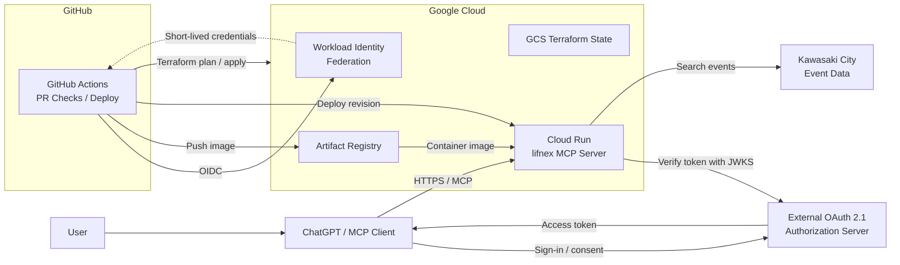

# lifnex

## About

**lifnex** (pronounced "life-nex") is a coined name combining **life** and **nexus**.

> Connect everyday life services, local data, and personal tools to AI assistants.

## Architecture

## Infrastructure

See [Infrastructure](infra/README.md) to provision the initial Google Cloud
environment or to plan and apply later Terraform changes.
