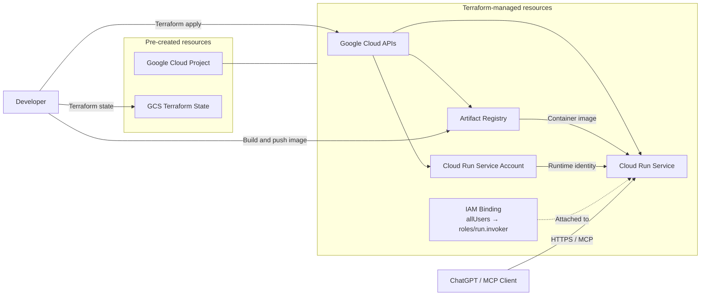

# Infrastructure

## Infrastructure diagram



The Google Cloud project and Terraform state bucket are created separately.
Remote MCP clients connect directly to the standard Cloud Run HTTPS endpoint.

## Initial setup

Authenticate with Google Cloud Application Default Credentials, then initialize
Terraform with the separately created state bucket:

```sh
gcloud auth application-default login

mise exec -- terraform -chdir=infra init \
  -backend-config="bucket=<TFSTATE_BUCKET>"
```
