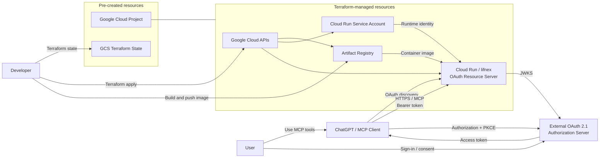

# Infrastructure

## Infrastructure diagram



The Google Cloud project and Terraform state bucket are created separately.
The OAuth authorization server is external and is not hosted in the Google
Cloud project or managed by this Terraform configuration. Remote MCP clients
connect directly to the standard Cloud Run HTTPS endpoint.

## OAuth authentication

The MCP endpoint uses an external OAuth 2.1 authorization server.

Each component has a separate responsibility:

- ChatGPT is the OAuth client. It discovers the authorization server, guides
  the user through sign-in, and sends the resulting access token with MCP
  requests.
- The external authorization server hosts the sign-in and consent flow and
  issues signed access tokens. Lifnex does not implement these OAuth endpoints
  itself.
- Lifnex is the resource server. It publishes protected resource metadata and
  accepts an MCP request only after verifying the token signature, issuer,
  audience, and expiration against the authorization server's public keys.

The authorization server is configured separately before OAuth support is
deployed. Lifnex verifies JWT access tokens locally through public JWKS and
does not require a provider API key. See the
[OpenAI MCP authentication guide](https://developers.openai.com/plugins/build/auth)
for the protocol requirements represented in this diagram.

Before deploying OAuth support, configure an external authorization server and
set `oauth_issuer_url`, `oauth_jwks_url`, and `oauth_resource_url` in
`terraform.tfvars`.

Configure the authorization server to issue JWT access tokens whose `iss`
matches `oauth_issuer_url` and whose audience matches `oauth_resource_url`.
These values are compared exactly, including paths and trailing slashes.

## Initial setup

Run the following commands from this directory.

Authenticate with Google Cloud Application Default Credentials, then initialize
Terraform with the separately created state bucket:

```sh
gcloud auth application-default login

cp terraform.tfvars.example terraform.tfvars
terraform init -backend-config="bucket=<TFSTATE_BUCKET>"
```

Set `project_id` and `region` in `terraform.tfvars` for the target environment.
Set `image_uri` after pushing the initial image as described below.

## Initial provisioning

Terraform manages the dependencies between Google Cloud resources. The initial
container image is built and pushed outside Terraform, so the first deployment
must pause after creating Artifact Registry.

Review and apply the Artifact Registry target and its Terraform-managed
dependencies:

The `-target` option is used only to bootstrap the initial container image, not
for routine changes.

```sh
terraform plan -target=google_artifact_registry_repository.app
terraform apply -target=google_artifact_registry_repository.app
```

Build and push the initial image from this directory:

```sh
APP_REPOSITORY_URL="$(
  terraform output -raw artifact_registry_app_repository_url
)"
REGISTRY_HOST="${APP_REPOSITORY_URL%%/*}"
IMAGE_URI="${APP_REPOSITORY_URL}/lifnex:$(git rev-parse --short HEAD)"

gcloud auth configure-docker "${REGISTRY_HOST}"
make -C .. build-image IMAGE_URI="${IMAGE_URI}"
docker push "${IMAGE_URI}"

printf '%s\n' 'Set the following in terraform.tfvars:'
printf 'image_uri = "%s"\n' "${IMAGE_URI}"
```

Set `image_uri` in `terraform.tfvars` to the displayed value, then apply the
complete configuration as described below.

## Apply changes

Review the plan, then apply the changes:

```sh
terraform plan
terraform apply
```
