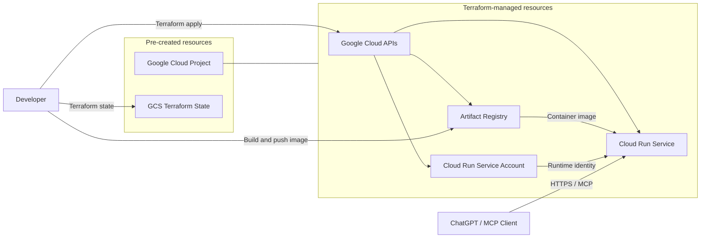

# Infrastructure

## Infrastructure diagram



The Google Cloud project and Terraform state bucket are created separately.
Remote MCP clients connect directly to the standard Cloud Run HTTPS endpoint.

## Initial setup

Run the following commands from this directory.

Authenticate with Google Cloud Application Default Credentials, then initialize
Terraform with the separately created state bucket:

```sh
gcloud auth application-default login

cp terraform.tfvars.example terraform.tfvars
terraform init -backend-config="bucket=<TFSTATE_BUCKET>"
```

Set `project_id` and `region` in `terraform.tfvars` for the target environment.
Set `image_uri` after pushing the initial image as described below.

## Initial provisioning

Terraform manages the dependencies between Google Cloud resources. The initial
container image is built and pushed outside Terraform, so the first deployment
must pause after creating Artifact Registry.

Review and apply the Artifact Registry target and its Terraform-managed
dependencies:

The `-target` option is used only to bootstrap the initial container image, not
for routine changes.

```sh
terraform plan -target=google_artifact_registry_repository.app
terraform apply -target=google_artifact_registry_repository.app
```

Build and push the initial image from this directory:

```sh
APP_REPOSITORY_URL="$(
  terraform output -raw artifact_registry_app_repository_url
)"
REGISTRY_HOST="${APP_REPOSITORY_URL%%/*}"
IMAGE_URI="${APP_REPOSITORY_URL}/lifnex:$(git rev-parse --short HEAD)"

gcloud auth configure-docker "${REGISTRY_HOST}"
make -C .. build-image IMAGE_URI="${IMAGE_URI}"
docker push "${IMAGE_URI}"

printf '%s\n' 'Set the following in terraform.tfvars:'
printf 'image_uri = "%s"\n' "${IMAGE_URI}"
```

Set `image_uri` in `terraform.tfvars` to the displayed value, then apply the
complete configuration as described below.

## Apply changes

Review the plan, then apply the changes:

```sh
terraform plan
terraform apply
```
